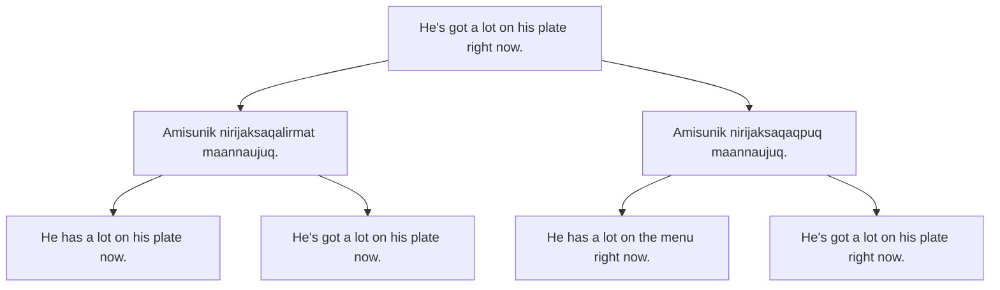
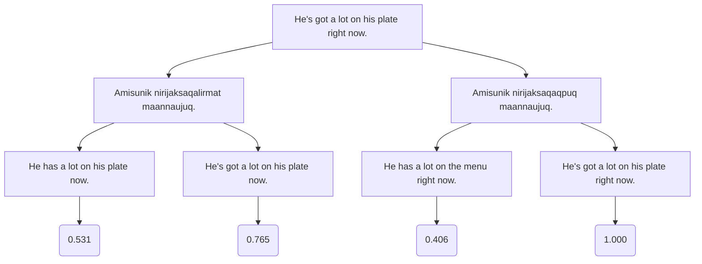

TLDR: Use monolingual data to optimize round-trip translation via GRPO. Sort of like backtranslation but without a concrete intermediate translation.

# Method

1. Given a sentence in English, generate multiple translations in the target language. For each translation, generate multiple English translations.

1. Score each **tgt → en** translation using BLEU/chrF/whatever

1. Run GRPO with two mixed tasks:
    1. **tgt → en** examples are scored using the BLEU scores
    2. **en → tgt** examples are scored using the summed BLEU score of their children, normalized

In the given example:

| Input | Output | Raw Reward | Normalized Reward |
| --- | --- | --- | --- |
| Amisunik nirijaksaqalirmat maannaujuq. | He has a lot on his plate now. | 0.531 | -0.7071 |
|  | He's got a lot on his plate now. | 0.765 | 0.7071 |
| Amisunik nirijaksaqaqpuq maannaujuq. | He has a lot on the menu right now. | 0.406 | -0.7071 |
|  | He's got a lot on his plate right now. | 1.000 | 0.7071 |
| He has a lot on his plate now. | Amisunik nirijaksaqalirmat maannaujuq. | 0.531+0.765 = 1.296 | -0.7071 |
|  | Amisunik nirijaksaqalirmat maannaujuq. | 1.406 | 0.7071 |

# Motivation

- Allows you to use any monolingual data to tune translation in *both directions* for *any target language*
- Jointly optimizes both directions without the noisy intermediate of backtranslation

# Concerns

- Probably won’t work on very low-resource languages, since the initial translations will be very high-variance and incorrect.
- A bit expensive to run since you need to do $g^2$ rollouts (g is group size), but most rollouts are pretty short so not a big deal.
- Possibility of reward hacking since the intermediate translation is not supervised. But I think a strong KL divergence weight should prevent too much drift.
